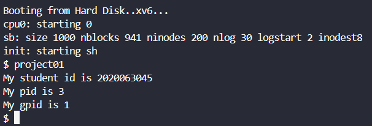
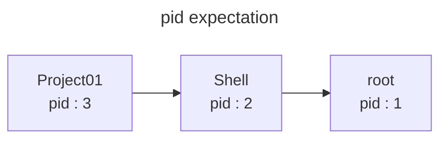

# Project 01

## Design

### getgpid

- `sys_getgpid`를 구현하기 위해 `sysproc.c` 파일 속에 있는 `sys_getpid`를 확인한다.

```c
// sysproc.c
int
sys_getpid(void)
{
  return myproc()->pid;
}
```

- 함수 안에 있는 `myproc()` 함수를 `proc.c` 파일 안에서 찾는다

```c
// proc.c
struct proc*
myproc(void) {
  struct cpu *c;
  struct proc *p;
  pushcli();
  c = mycpu();
  p = c->proc;
  popcli();
  return p;
}
```

- `myproc()` 함수는 `proc` 구조체 포인터를 반환하는 함수이다.
- 구조체 `proc` 의 정의는 `proc.h` 에서 확인할 수 있다.

```c
// proc.h
// Per-process state
struct proc {
  uint sz;                     // Size of process memory (bytes)
  pde_t* pgdir;                // Page table
  char *kstack;                // Bottom of kernel stack for this process
  enum procstate state;        // Process state
  int pid;                     // Process ID
  struct proc *parent;         // Parent process
  struct trapframe *tf;        // Trap frame for current syscall
  struct context *context;     // swtch() here to run process
  void *chan;                  // If non-zero, sleeping on chan
  int killed;                  // If non-zero, have been killed
  struct file *ofile[NOFILE];  // Open files
  struct inode *cwd;           // Current directory
  char name[16];               // Process name (debugging)
};
```

- `proc` 구조체 안에 있는 `parent` 를 통해 현재 실행중인 프로세스의 부모 프로세스를 접근할 수 있고, `pid` 를 통해 pid를 조회할 수 있다.
- 따라서, `getgpid`는 `myproc()->parent->parent->pid`로 구현할 수 있다.

### User program : project01

- 구현해야 할 `project01` 프로그램은 나의 학번과, `getpid`로 조회한 pid, `getgpid`로 조회한 gpid를 출력하면 된다.

## Implement

### getgpid

- `sys_getgpid` 함수를 `sys_getpid` 밑에 구현한다.

```c
// sysproc.c
int
sys_getgpid(void)
{
  return myproc()->parent->parent->pid;
}
```

- `syscall.h` , `syscall.c` , `user.h` , `usys.S` 파일에 시스템 콜에 대한 정보를 추가한다.
- 기존 파일에 시스템 콜을 구현했기 때문에, `defs.h`에 따로 선언하지 않는다.

- `SYS_getgpid` 을 등록한다.

```c
// syscall.h
#define SYS_getgpid 23
```

- `sys_getgpid` 을 등록한다.

```c
// syscall.c
extern int sys_getgpid(void);

static int (*syscalls[])(void) = {
...
[SYS_getgpid] sys_getgpid,
};
```

- user program에서 `getgpid`가 보이도록 `user.h`에 등록한다.

```c
// user.h
int getgpid(void);
```

- Macro를 등록한다.

```nasm
@ usys.S
SYSCALL(getgpid)
```

### User Program : project01

- `project01.c` 파일 생성 후, main 함수를 구현한다.

```c
#include "types.h"
#include "user.h"

int main(int argc, char *argv[]) {
    char *student_id = "2020063045";
    int pid = getpid();
    int gpid = getgpid();
    printf(1, "My student id is %s\n", student_id);
    printf(1, "My pid is %d\n", pid);
    printf(1, "My gpid is %d\n", gpid);

    exit();
}
```

- Makefile에 user program에 대한 정보를 추가한다.

```makefile
UPROGS=\
	...
	_project01\
	

EXTRA=\
	...
	.gdbinit.tmpl gdbutil project01.c\
```

## Result

- Qemu 실행 명령 파일을 생성한다.

```bash
# bootxv6.sh
qemu-system-i386 -nographic -serial mon:stdio -hdb fs.img xv6.img -smp 1 -m 512
```

- 컴파일 및 실행

```bash
$ make clean
$ make 
$ make fs.img
$ sh bootxv6.sh
```

- 실행 결과



## Trouble shooting

- 시스템 콜을 외부 파일에서 구현하고, `make` 명령어를 실행 중 에러가 발생했다.
- 외부 파일에서 `defs.h` 헤더를 불러와 `myproc` 함수를 호출하는 도중, `proc` 구조체 내부의 변수 중 다른 헤더 파일에 정의된 구조체들이 있었다.
- 이 구조체들에 대한 정의가 외부 파일에 없어서 에러가 발생했다. 이를 해결하기 위해서는,
    1. `make` 명령어를 실행해 에러를 발생하는 구조체를 찾는다.
    2. 그 구조체가 포함된 헤더파일을 찾는다.
    3. 헤더파일을 외부 파일에 `include`한다.
- 이 과정을 계속 반복하는 것은 시간이 많이 필요하다고 판단해서, 이미 정상적으로 실행 가능하다고 생각하는 `getpid` 시스템 콜이 구현된 파일에 `getgpid`를 구현했다.

---

## getppid

- 구현한 user program과 pdf에 나온 예시가 같은 값을 보였다.
- pid가 1인 프로세스는 root프로세스이고, user program의 pid값은 3이다.
- user program은 shell을 통해 실행되기 때문에, 실행 중인 다른 프로그램이 없을 때, shell의 pid는 2로 추정된다.



- getppid 구현

```c
// sysproc.c
int
sys_getppid(void){
  return myproc()->parent->pid;
}
```

- user program 수정

```c
// project01.c
#include "types.h"
#include "user.h"

int main(int argc, char *argv[]) {
    char *student_id = "2020063045";
    int pid = getpid();
    int ppid = getppid();
    int gpid = getgpid();
    printf(1, "My student id is %s\n", student_id);
    printf(1, "My pid is %d\n", pid);
    printf(1, "My ppid is %d\n", ppid);
    printf(1, "My gpid is %d\n", gpid);

    exit();
}
```

- 앞에 `getgpid`와 같이, `syscall.h` , `syscall.c` , `user.h` , `usys.S` 파일에 시스템 콜에 대한 정보를 추가한다.
- 실행 결과

