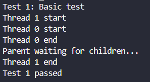
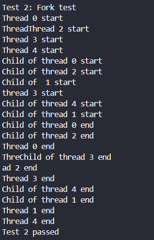
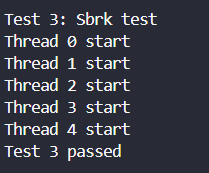
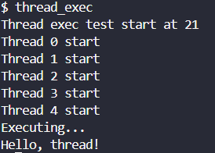
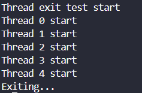
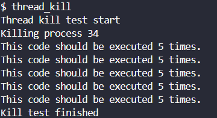

# Project 3 - Light Weight Process

## Design

### Thread 설계
- User Stack : LWP(이하 Thread)는 스케줄링 단계에서 프로세스와 동일하게 작동한다. 따라서 Thread는 프로세스와 동일한 구조체를 사용하지만, 메모리 영역을 공유하기 때문에 같은 page table을 사용한다. 추가로, 동일한 file descriptor를 공유한다. 
- Thread Id : 모든 Thread는 프로세스 id와 구분되는 각각의 id를 가지고 있다. 또한, Thread를 생성하는 프로세스(`fork`로 인해 생성됨)는 Main Thread라고 하며, Main Thread의 id는 0이다. 
- Main Thread : 모든 Thread는 Main Thread의 종속적이며, 이것은 Thread의 생성 순서나 Thread의 자식 Thread와는 상관이 없다. 이는 모든 Thread는 Main Thread와 동일한 프로세스 id를 가지고, 같은 부모 프로세스를 공유한다. 만약 생성된 Thread가 자식 Thread를 생성하게 되면, 자식 Thread는 부모 Thread의 Main Thread에 종속적이다.
- Exec & Exit : Thread는 `exec` 시스템 콜을 통해 새로운 프로그램을 실행할 수 있으며, `exit` 시스템 콜을 통해 종료할 수 있다. 이때, 특정 Thread(Main Thread 포함)가 `exec`함수나 `exit`함수를 호출하면, 해당 프로세스의 모든 Thread는 종료된다 (`exec`인 경우는 하나의 Thread가 새로운 프로세스로 변경됨).

### System Call 설계
- Thread의 특성을 고려하여 설계해야 한다. Thread는 프로세스와 동일한 구조체를 사용하므로, 프로세스와 동일한 시스템 콜을 사용할 수 있다는 것을 고려해야 한다.

## Implement

### Thread
- 모든 자료형 및 함수는 `thread.h` 헤더 파일에 선언되어 있다.
- `thread_t` : Thread의 id를 나타내는 자료형이다.
- 프로세스 구조체에 Thread의 id, Main Thread의 포인터, Thread의 반환값을 저장할 수 있는 변수를 추가한다.
```c
// proc.h

// Per-process state
struct proc {
  ...
  int tid;                     // Thread ID
  struct proc *main;           // Main thread
  void* retval;                // Return value
};
```

#### Thread Creation
| return | name | arguments | description |
|:------:|:----:|:---------:|:-----------:|
| int | _thread_create | thread_t *thread, void *(*start_routine)(void *), void *arg | 새로운 Thread를 생성한다. |

- `thread`는 생성된 Thread의 id를 저장할 포인터이다.
- `start_routine`은 Thread가 실행할 함수의 포인터이다.
- `arg`는 `start_routine`에 전달할 인자이다.

1. `myproc` 함수를 통해 현재 실행 중인 프로세스를 가져온다.
2. `allocproc` 함수를 통해 새로운 Thread를 생성한다. (프로세스 구조체를 사용해 새로운 Thread를 생성한다.)
3. 생성한 Thread에 `pid`, `tid`, `main`, `pgdir`, `parent`, `tf`를 설정한다.
4. 생성한 Thread의 유저 메모리(스택)를 실행 중인 프로세스 구조체에 할당하고, Thread `sz`를 갱신한다.
5. 생성한 Thread의 스택에 `arg`를 넣고, `tf`의 `eip`를 `start_routing`으로 설정하고 `esp`를 갱신한다.
6. 생성한 Thread의 `sz`를 바탕으로, 다른 Thread의 `sz`를 갱신한다.
7. 파일 디스크립터를 공유한다.
8. Thread의 이름을 설정하고, 생성한 Thread의 id를 `thread`에 저장한다.
9. 생성한 Thread의 `state`를 `RUNNABLE`로 설정해 스케줄링 큐에 넣는다.

#### Thread Termination
| return | name | arguments | description |
|:------:|:----:|:---------:|:-----------:|
| void | _thread_exit | void *retval | 현재 Thread를 종료한다. |
- `retval`는 Thread가 `start_routine`을 실행 한 후의 반환값이다.

1. `myproc` 함수를 통해 현재 실행 중인 프로세스를 가져온다.
2. 만약 현재 Thread가 Main Thread라면, 모든 Thread를 종료하고 열린 모든 파일을 닫는다.
3. Thread가 작업했던 디렉토리를 닫는다.
4. 종료할 Thread의 자식 프로세스를 `initproc`의 자식으로 변경한다.
5. 만약 현재 Thread가 Main Thread가 아니라면 Main Thread를 깨우고, 아니면 부모 프로세스를 깨운다.
6. 현재 Thread의 `retval`을 설정하고, `state`를 `ZOMBIE`로 설정한다.
7. 스케줄링을 진행한다.

#### Thread Waiting
| return | name | arguments | description |
|:------:|:----:|:---------:|:-----------:|
| int | _thread_join | thread_t thread, void **retval | 특정 Thread가 종료될 때까지 대기한다. |
- `thread`는 대기할 Thread의 id이다.
- `retval`은 대기한 Thread의 반환값을 저장할 포인터이다.

1. `myproc` 함수를 통해 현재 실행 중인 프로세스를 가져온다.
2. 대기할 Thread를 찾는다.
3. 만약 대기할 Thread가 종료되지 않았다면, 현재 Thread를 `SLEEPING` 상태로 변경하고, 대기할 Thread를 깨운다.
4. 대기할 Thread가 종료되었다면, `retval`에 반환값을 저장하고, 대기한 Thread를 종료한다.

### `proc.c`

#### `initproc`
- `thread.c`에서 사용하기 위해 `initproc` 변수를 `extern`으로 변경했다.
#### `wakeup1`
- `thread.c`에서 사용하기 위해 `initproc` 변수를 `extern`으로 변경했다.
#### `allocproc`
- `thread.c`에서 사용하기 위해 `initproc` 변수를 `extern`으로 변경했다.
- Thread에서 사용하는 `proc` 구조체의 변수를 초기화하는 부분이 추가되었다.
```c
struct proc *
allocproc(void)
{
  ...
  found:
    p->state = EMBRYO;
    p->pid = nextpid++;

    // EDITED : Thread
    p->tid = 0;
    p->main = p;
  ...
}
```

#### `growproc`
- 여러 Thread가 동시에 메모리 할당을 요청할 때, `proc`의 `sz`가 변경되거나 할당 부분이 겹치지 않도록 전체 부분을 critical section으로 설정했다.
```c
int growproc(int n)
{
  ...
  acquire(&ptable.lock);
  ...
  release(&ptable.lock);
  ...
}
```

#### `exit`
- Thread(Main Thread 포함)가 `exit` 시스템 콜을 호출했을 때, 모든 Thread가 종료되도록 수정했다.
```c
void exit(void){
  ...
  for (struct proc *p = ptable.proc; p < &ptable.proc[NPROC]; p++)
  {
    if (p->pid == curproc->pid)
    {
      p->state = ZOMBIE;
      p->cwd = 0;

      for(int fd = 0; fd < NOFILE; fd++){
        if(p->ofile[fd]){
          p->ofile[fd] = 0;
        }
      }
    }
  }
  ...
}
```

#### `wait`
- `ZOMBIE` 상태의 프로세스(Thread 포함)를 모두 찾아서 초기화하도록 수정했다.
```
int wait(void){
  ...
  for (struct proc *p = ptable.proc; p < &ptable.proc[NPROC]; p++)
  {
    if (p->state == ZOMBIE && p->parent == curproc)
    {
      p->state = UNUSED;
      p->pid = 0;
      p->parent = 0;
      p->name[0] = 0;
      p->killed = 0;
      p->main = 0;
      p->tid = 0;
      p->retval = 0;
      for(; p < &ptable.proc[NPROC]; p++)
      {
        if (p->parent != curproc)
          continue;
        if(p->state == ZOMBIE){
          kfree(p->kstack);
          if (p->tid == 0)
          {
            freevm(p->pgdir);
          }
          p->kstack = 0;
          p->pid = 0;
          p->parent = 0;
          p->name[0] = 0;
          p->killed = 0;
          p->state = UNUSED;
        }
      }
      release(&ptable.lock);
      return pid;
    }
  }
  ...
}

```

## Result

### `thread_test`

#### Test 1

- Thread 0과 1이 생성되고, Thread 0이 종료되고 1초 후에 Thread 1이 종료된다.

#### Test 2

- Thread가 `fork`를 통해 자식 프로세스를 생성하고, 같은 주소공간(`int status`)을 공유하는지 확인한다.

#### Test 3

- 각각의 Thread가 메모리를 할당 받을 때, 겹치는 부분 없이 정상적으로 할당되는지 확인한다.

### `thread_exec`

- Thread가 `exec` 시스템 콜을 통해 새로운 프로그램을 실행하는지 확인한다.

### `thread_exit`

- Thread가 `exit` 시스템 콜을 통해 종료했을 때, 모든 Thread가 종료되는지 확인한다.

### `thread_kill`

- Thread가 `kill` 시스템 콜을 통해 종료될 때, 모든 Thread가 종료되는지 확인한다. 

## Trouble Shooting

### `_thread_create`
- Thread는 프로세스와 동일한 구조체를 사용하므로, 새로 Thread를 생성할 때 기존에 프로세스를 생성하는 함수인 `allocproc`함수를 사용했다. 생성한 `proc` 구조체 내부에 Thread에서 사용되는 변수들을 변경해 코드의 재사용성을 높였다. 하지만 `allocproc` 함수를 호출할 때마다 `nextpid` 값이 증가하기 때문에, 사용하지 않는 `pid`가 발생한다.
- Thread의 Stack을 할당할 때, 2 x PGSIZE를 할당하도록 했다. 이는 Guard Page를 사용하기 위함이다. 이후 `clearpteu` 함수를 통해 Guard Page를 초기화했다.

### `_thread_exit`
- 만약 Main Thread가 이 함수를 호출하면, 모든 Thread를 종료하고 열린 파일을 닫아야 한다. 이를 위해 `kill` 함수를 호출할 때처럼 모든 Thread의 `killed`를 1로 설정하고, trap 함수에서 `exit` 함수를 호출하도록 했다.

### `_thread_join`
- 내부 구조는 `wait` 함수와 유사하다.

### `ofile` & `cwd`
- Thread는 프로세스와 동일한 파일 디스크립터를 사용하므로, `ofile`과 `cwd`를 공유한다.
- 하지만 하나의 Thread가 `exit`함수를 호출해 모든 Thread가 종료되거나, `exec` 함수를 호출할 때 하나의 Thread만 남기 때문에, `ofile`과 `cwd`를 복제할 때 `filedup`이나 `idup`을 호출하지 않았다. 즉 다른 프로세스가 아니라면, 구조체의 `ref` 변수를 증가시키지 않았다. 여러 Thread를 종료할 때, `fileclose` 함수나 `iput` 함수는 총 한번만 실행된다.

# Locking
- 기본적으로 c의 inline assembly를 이용해 atomic swap을 구현할 수 있다.
- x86에서는 `xchg` 명령어를 이용해 atomic swap을 구현할 수 있고, arm64에서는 `ldxr`과 `stxr` 명령어를 이용해 atomic swap을 구현할 수 있다.
- atomic swap을 이용해 `compare_and_swap` 함수를 구현하고, 이 함수를 통해 spinlock을 구현할 수 있다. 