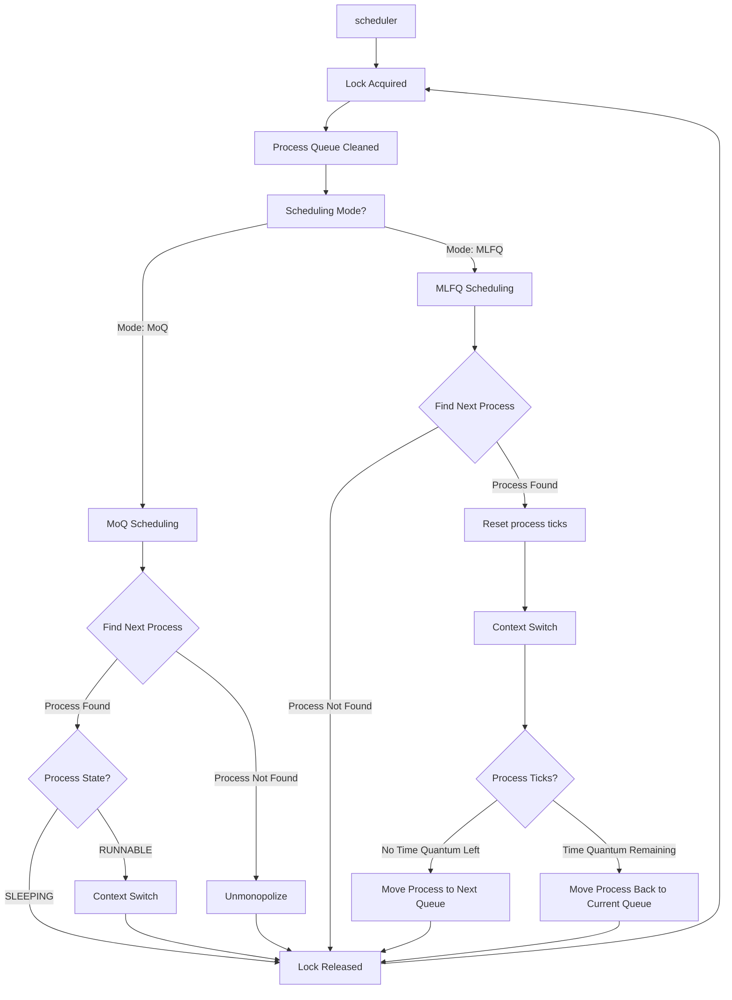
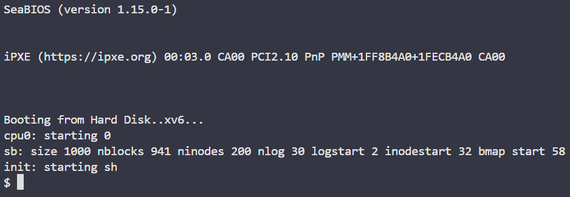
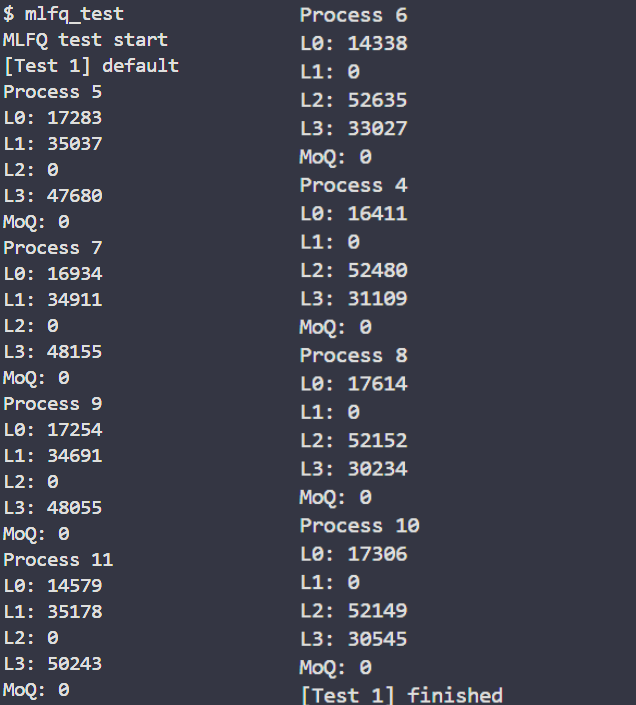
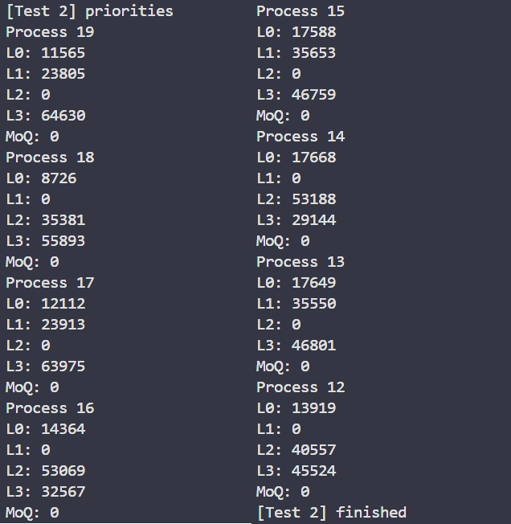
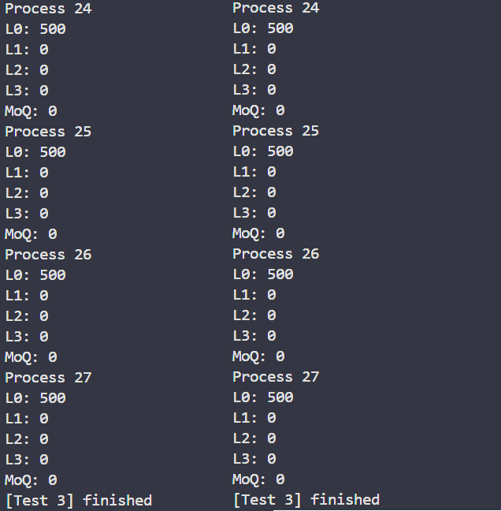
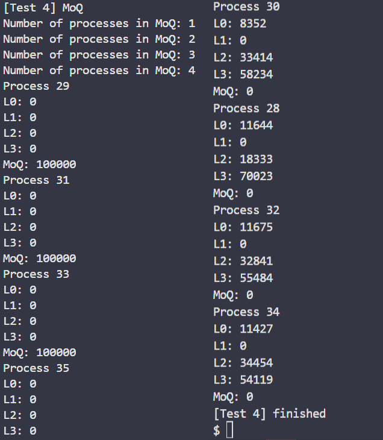

# Project02 Wiki

# Project 02

## Code Analysis

### 프로세스 생성

- 모든 프로세스 생성 과정에는 `allocproc()` 함수를 통해 새로운 `proc` 구조체를 할당 받는 부분이 있다. (`userinit()`, `fork()`)
- `allocproc()`로 인해 생성된 모든 프로세스 구조체는 함수 내에서 `ptable.proc` 배열에 저장된다.

### 프로세스 구조

- 스케줄링에 필요한 구조체 변수는 두가지가 있다.
    1. `int pid` : 프로세스 ID를 나타낸다.
    2. `enum procstate state` : 프로세스 상태를 나타낸다. 스케줄링에서 다음 프로세스를 선택하는 과정에서는 `RUNNABLE` 만 확인해주면 된다.

### Timer Interrupt

- timer interrupt가 발생하면 `trap()` 함수를 호출하고, 함수 내부에서 global tick인 `ticks` 를 1 증가시킨다.
- 현재 상태가 `RUNNING` 인 프로세스가 존재하면, `yield()` 함수를 통해 프로세스 상태를 변경하 스케줄러를 호출한다.

### 스케줄링 과정

1. `main()` 함수에서 스케줄러(`scheduler()`) 실행
2. 스케줄러에서 `ptable.proc` 을 순회하면서 `RUNNABLE`한 프로세스 탐색
3. 선택된 프로세스의 context를 cpu에 로드하고 (context switch), 프로세스 상태를 `RUNNING`으로 변경
4. Timer interrupt가 발생하면, `yield()` 함수를 호출해 진행 중인 프로세스중단
5. 스케줄러 다시 호출
- 현재 구현된 스케줄러는 모든 프로세스에게 1 tick 만큼의 시간을 할당하는 공평한 round robin 방식이다.

## Design

### Scheduler

- MLFQ, MoQ를 순회하면서 `UNUSED` 혹은 `ZOMBIE` 상태의 프로세스를 queue에서 제거한다.
- 스케줄러 모드가 `MoQ`이면 FCFS 스케줄링(MoQ)을 진행하고, `MLFQ`이면 round robin과 priority 스케줄링(MLFQ)을 진행한다.

### Trap

- Timer interrupt가 발생할 때마다 `ticks`가 1만큼 증가하게 된다. 이때, `ticks % 100` 가 0이 될 때마다 priority boosting을 진행한다.
- 프로세스의 tick이 (queue level x 2 + 2) 보다 커지면 `yield()` 함수를 호출한.

### MLFQ

- L0 ~ L3까지 모든 MLFQ는 circular queue로 구현한다.
- 스케줄러가 호출될 때마다(`sched()` 함수 호출), 모든 MLFQ 를 queue level 순서대로 `head` 부터 `tail` 까지 순회한다.
    - L0 ~ L2 MLFQ는 가장 먼저 `RUNNABLE` 한 프로세스를 찾는다.
    - L3 MLFQ는 가장 높은 priority를 가지면서 `RUNNABLE`한 프로세스를 찾는다.
- Context switching을 통해 선택된 프로세스를 실행한다.
- 프로세스가 실행된 다음(`yield()` 함수가 호출 된 다음), 주어진 time quantum이 전부 사용되었는지 확인한다.
    - 만약, 전부 사용되었으면 다음 레벨의 queue로 프로세스를 이동시킨다.
    - 아니면, 같은 레벨의 queue 맨 뒤로 이동시킨다.
- 만약 global tick (`ticks`)이 100이 되면 priority boosting을 실행한다.
    - 모든 MLFQ를 순회하면서, `UNUSED` 혹은 `ZOMBIE`를 제외한 모든 프로세스를 L0 queue에 넣는다.

### MoQ

- MoQ는 circular queue로 구현된다.
- 스케줄러가 호출될 때마다(`sched()` 함수 호출), `head` 부터 `tail` 까지 MOQ에 있는 프로세스 중 `RUNNABLE` 혹은 `SLEEPING` 상태의 프로세스를 찾는다.
    - 만약 프로세스를 찾지 못하면 `_unmonopolize()` 함수를 호출한다.
- Context switching을 통해 선택된 프로세스를 실행한다.

### System calls

### `void yield(void)`

- `proc.c` 내부에 있는 `yield(void)`를 호출한다.

### `int getlev(void)`

- `proc` 구조체 내부에 현재 queue level을 저장할 `qlevel` 변수를 추가한다.
- 함수가 호출되면 `qlevel`을 반환한다.

### `int setpriority(int pid, int priority)`

- `proc` 구조체 내부에 현재 priority를 저장할 `priority` 변수를 추가한다.
- `pid` 프로세스를 찾고, `priority` 변수를 변경한다.

### `int setmonopoly(int pid, int password)`

- `pid` 프로세스를 찾고, `L(qlevel)` MLFQ에서 프로세스를 제거하고, MoQ에 넣는다.

### `void monopolize()`

- 스케줄러 모드를 `MoQ`로 바꾼다.

### `void unmonopolize()`

- 스케줄러 모드를 `MLFQ`로 바꾼다.
- `ticks`를 0으로 바꾼다.

## Implement

### 0. `struct proc`

```c
// proc.h
struct  proc {
	...
	// EDITED
	int  idx; // Process index in ptable.proc
	int  priority; // Priority of the process
	int  ticks; // Number of ticks the process has run for
	int  qlevel; // Queue level of the process
};

```

- 기존 프로세스 구조체에 상태를 저장할 변수를 추가했다.
    - `int idx` : `ptable.proc`에 저장된 index를 저장한다. 프로세스가 종료될 때까지 변하지 않는다.
    - `int priority` : 초기값 0을 가진다. `setpriority` 함수를 통해 바뀔 수 있다.
    - `int ticks` : 프로세스가 진행된 시간을 나타낸다. Timer interrupt 발생 시, 1씩 증가한다.
    - `int qlevel` : 프로세스가 현재 있는 queue level을 나타낸다. Time quantum을 다 사용하고 다음 queue로 이동할 때 바뀔 수 있다.

### 1. `struct queue`

```c
// queue.h
struct queue
{
	int idxs[QUEUE_SIZE];
	int size;
	int head;
	int tail;
};

```

- `queue`는 circular queue 자료구조이고, 정수형 데이터를 저장한다.
- `QUEUE_SIZE`는 `NPROC + 1` 을 나타낸다. 이는 최대 `NPROC`개의 프로세스가 queue에 들어가기 때문이고, circular queue에서 `head`와 `tail`이 겹치지 않게 하기 위함이다.
- queue의 최대 사이즈는 `NPROC`이다.

| Return Type | Name | Parameter | Description |
| --- | --- | --- | --- |
| int | is_empty | struct queue *q | queue가 비어있으면 1, 아니면 0 반환한다. |
| int | is_full | struct queue *q | queue가 다 차있으면 1, 아니면 0 반환한다. |
| void | init | struct queue *q | queue를 초기화한다. |
| void | push | struct queue *q, int target | queue에 값을 넣는다. |
| void | pop | struct queue *q | queue의 가장 앞에 있는 값을 뺀다. |
| int | front | struct queue *q | queue의 가장 앞에 있는 값을 반환한다. |
| int | delete | struct queue *q, int target | queue 안에 일치하는 값을 제거한다. |
- Makefile 추가

```
OBJS = \\
	...
	queue.o\\
```

### 2. `enum _sched_mode sched_mode`

```c
// proc.h
enum _sched_mode{
	MLFQ,
	MoQ
};
```

- `_sched_mode`에는 `MLFQ`, `MoQ` 두 가지 모드가 존재한다.

```c
// proc.c
enum _sched_mode sched_mode;
```

- 전역 변수로 사용할 `sched_mode`를 선언한다.

```c
// defs.h
extern enum _sched_mode sched_mode;
```

- 다른 파일에서 접근할 수 있도록 `defs.h`에도 선언해준다.

### 3. `struct ptable`

```c
// proc.c
struct
{
	struct spinlock lock;
	struct proc proc[NPROC];
	struct queue mlfq[4];
	struct queue moq;
} ptable;
```

- 기존 `ptable`에 `mlqf`와 `moq`가 추가되었다. 각각의 배열에는 `ptable.proc`에 저장된 프로세스의 index가 들어간다.
- `mlfq`는 4개의 `queue`를 가지는 배열이며, index는 queue level을 나타낸다.

### 4. `void pinit(void)`

```c
// proc.c
void pinit(void)
{
	initlock(&ptable.lock, "ptable");
	// EDITED : initialize queues
	for (int i = 0; i < 3; i++)
	{
		init(&ptable.mlfq[i]);
	}
	init(&ptable.moq);

	// EDITED : initialize sched_mode
	sched_mode = MLFQ;
}
```

- `ptable` 내부의 queue들을 초기화하고, 스케줄링 모드를 `MLFQ`로 설정한다.

### 5. `static struct proc * allocproc(void)`

```c
static struct proc *
allocproc(void)
{
	...

	found:
	p->state = EMBRYO;
	p->pid = nextpid++;

	// EDITED : initialize process and push to L0 queue
	p->priority = 0;
	p->qlevel = 0;
	p->idx = p - ptable.proc;
	push(&ptable.mlfq[0], p->idx);

	release(&ptable.lock);

	...
}
```

- 모든 프로세스 생성은 `allocproc(void)` 함수를 호출한다.
- 따라서, `allocproc(void)` 함수가 호출될 때, 새로운 프로세스를 초기화 해주고, L0 queue에 넣어주면 된다.

### 6. `void optimqueue()`

```c
// proc.c
void  optimqueue(){
	struct  proc  *p;
	for(p  =  ptable.proc; p  <  &ptable.proc[NPROC]; p++){
		if((p->state  ==  ZOMBIE  ||  p->state  ==  UNUSED) &&  p->pid  !=  0){
			if(p->qlevel  ==  99  &&  sched_mode  ==  MoQ){
				delete(&ptable.moq, p->idx);
			}
			else{
				delete(&ptable.mlfq[p->qlevel], p->idx);
			}
		}
	}
}
```

- 프로세스 테이블을 순회하며 상태가 ZOMBIE 또는 UNUSED인 프로세스를 큐에서 lazy하게 제거하는 함수이다.
- `ptable.proc`에서 시작하여 `ptable.proc[NPROC]`까지 프로세스 테이블을 순회한다. 각 프로세스에 대해, 프로세스의 상태가 ZOMBIE 또는 UNUSED이고 프로세스 ID가 0이 아닌 경우, 해당 프로세스를 큐에서 제거한다.
- 프로세스를 제거할 때, `qlevel`이 99이고 `sched_mode`가 `MoQ`인 경우, 프로세스는 `ptable.moq`에서 제거한다.
- 그렇지 않은 경우, 프로세스는 `ptable.mlfq[qlevel]`에서 제거한다.
- 이 함수는 매 스케줄링마다 호출되어, 사용되지 않을 프로세스를 스케줄링 큐에서 제거하는 역할을 한다.

### 7. `int findnextprocidx()`

```c
// proc.c
int findnextprocidx()
{
	if(sched_mode == MoQ){
		struct queue  *q = &ptable.moq;
		struct proc *p;
		for(int idx = q->head; idx != q->tail; idx = (idx + 1) % (NPROC + 1))
		{
			p = &ptable.proc[q->idxs[idx]];
			if (p->state == RUNNABLE || p->state == SLEEPING)
			{
				return q->idxs[idx];
			}
		}
		return -1;
	}
	// 0 ~ 2 : round robin scheduling
	for(int i = 0; i < 3; i++)
	{
		struct queue *q = &ptable.mlfq[i];
		for(int idx = q->head; idx != q->tail; idx = (idx  +  1) % (NPROC + 1))
		{
			struct proc *p = &ptable.proc[q->idxs[idx]];
			if (p->state == RUNNABLE)
			{
				return q->idxs[idx];
			}
		}
	}
	struct queue *q  = &ptable.mlfq[3];
	struct proc *p, *next_p;
	int max_priority = -1;
	// 3 : priority scheduling
	for (int idx = q->head; idx != q->tail; idx = (idx + 1) % (NPROC + 1))
	{
		p = &ptable.proc[q->idxs[idx]];
		if (p->state == RUNNABLE && max_priority < p->priority)
		{
			max_priority = p->priority;
			next_p = p;
		}
	}
	if (max_priority != -1)
	{
		return next_p->idx;
	}
	return -1;
}
```

- 다음에 실행할 프로세스를 선택하는 함수이다.
- `sched_mode`가 `MLFQ`이면 `ptable.mlfq[0]`부터 `ptable.mlfq[3]`까지 모든 queue를 순회하면서 가장 먼저 만나는 `RUNNABLE` 프로세스의 `proc.idx`를 반환한다.
    - L3는 `RUNNABLE`하면서 가장 높은 priority를 가진 프로세스의 `proc.idx`를 반환한다.
- `sched_mode`가 `MoQ`이면 `ptable.moq`를 순회하면서 가장 먼저 만나는 `RUNNABLE` 또는 `SLEEPING` 프로세스의 `proc.idx`를 반환한다.
    - `SLEEPING` 프로세스는 스케줄러에서 따로 처리해준다.

### 8. `int _setpriority(int pid, int priority)`

```c
// proc.c
int _setpriority(int pid, int priority)
{
	if(priority < 0 || priority > 10)
	{
		return -2;
	}
	acquire(&ptable.lock);
	int i = 0;
	for(; i < NPROC; i++){
		if(ptable.proc[i].pid == pid){
			break;
		}
	}
	if(i == NPROC)
	{
		release(&ptable.lock);
		return -1;
	}
	struct proc *p = &ptable.proc[i];
	p->priority = priority;
	release(&ptable.lock);
	return 0;
}
```

- 이 함수는 특정 프로세스의 우선순위를 설정하는 함수이다.
- `pid`는 우선순위를 변경하려는 프로세스의 프로세스 ID이고, `priority`는 설정하려는 우선순위 값이다.
- `priority`가 0 미만이거나 10 초과면 함수는 `2`를 반환하며, 이는 잘못된 우선순위 값임을 나타낸다.
- `ptable.lock`을 획득하여 프로세스 테이블에 대한 동시 접근을 방지하고, 이후에는 프로세스 테이블을 순회하면서 `pid`가 일치하는 프로세스를 찾는다.
- 일치하는 프로세스를 찾으면, 해당 프로세스의 `priority` 필드를 입력 매개변수로 받은 `priority` 값으로 설정한다.
- `ptable.lock`을 해제하고, 0을 반환한다.
- 만약 `pid`가 일치하는 프로세스를 찾지 못하면, `ptable.lock`을 해제하고 `1`을 반환한다.

### 9. `_setmonopoly(int pid, int password)`

```c
// proc.c
int _setmonopoly(int pid, int password)
{
	if(password != 2020063045)
	{
		return -2;
	}
	acquire(&ptable.lock);
	struct proc *p;
	for (p = ptable.proc; p < &ptable.proc[NPROC]; p++)
	{
		if (p->pid == pid)
		{
			delete(&ptable.mlfq[p->qlevel], p->idx);
			p->qlevel = 99;
			push(&ptable.moq, p->idx);
			release(&ptable.lock);
			return ptable.moq.size;
		}
	}
	release(&ptable.lock);
	return -1;
}
```

- 이 함수는 특정 프로세스를 `ptable.moq`에 넣는 함수이다.
- `pid`는 우리가 모노폴리를 설정하려는 프로세스의 프로세스 ID이고, `password`는 이 함수를 호출할 수 있는 권한을 확인하는 데 사용된다.
- 만약 `password`가 `2020063045`와 같지 않으면 함수는 `2`를 반환한다.
- 다음으로, `ptable.lock`을 획득하여 프로세스 테이블에 대한 동시 접근을 방지하고, `ptable.proc`을 순회하면서 `pid`가 일치하는 프로세스를 찾는다.
- 일치하는 프로세스를 찾으면, 해당 프로세스를 현재의 큐에서 삭제하고, `qlevel`을 `99`로 설정한다. 그런 다음 프로세스를 `ptable.moq` 에 넣는다.
- `ptable.lock`을 해제하고, `ptable.moq.size`를 반환한다. 이는 현재 MoQ에 들어간 프로세스의 수이다.
- 만약 `pid`가 일치하는 프로세스를 찾지 못하면, `ptable.lock`을 해제하고 `1`을 반환한다.

### 10. `void _monopolize(void)`

```c
// proc.c
void _monopolize(void)
{
	sched_mode = MoQ;
	yield();
}
```

- 이 함수는 `sched_mode`를 `MoQ`로 변경하는 함수이다.
- 그런 다음 `yield()` 함수를 호출한다. 이러면, 스케줄러가 **즉시** 새로운 프로세스를 선택하게 되고, 이 때 `sched_mode`가 `MoQ`로 설정되어 있으므로 `ptable.moq`에서 프로세스를 선택하게 된다.

### 11. `void _unmonopolize(void)`

```c
// proc.c
void _unmonopolize(void)
{
	sched_mode = MLFQ;
	acquire(&tickslock);
	ticks = 0;
	release(&tickslock);
}
```

- 이 함수는 `sched_mode`를 `MLFQ`로 변경하는 함수이다.
- `tickslock`을 획득하여 `ticks` 변수에 대한 동시 접근을 방지하고, `ticks` 을 0으로 초기화한다.
- 이후에는 `tickslock`을 해제한다.

### 12. `void priorityboost(void)`

```c
// proc.c
void priorityboost()
{
	if(sched_mode == MoQ)
	{
		return;
	}
	acquire(&ptable.lock);
	init(&ptable.mlfq[1]);
	init(&ptable.mlfq[2]);
	init(&ptable.mlfq[3]);
	for (int i = 0; i < NPROC; i++)
	{
		if (ptable.proc[i].state != UNUSED && ptable.proc[i].state  != ZOMBIE && ptable.proc[i].qlevel != 0 && ptable.proc[i].qlevel  != 99)
		{
			ptable.proc[i].qlevel = 0;
			ptable.proc[i].ticks = 0;
			push(&ptable.mlfq[0], i);
		}
	}
	release(&ptable.lock);
}
```

- 이 함수는 우선순위 부스팅을 수행하는 함수이다.
- 함수는 먼저 `sched_mode`가 `MoQ`인지 확인한다. `MoQ`에서는 특정 프로세스가 CPU를 독점하므로 priority boosting을 하지 않는다.
- 그렇지 않은 경우, 함수는 프로세스 테이블에 대한 락을 획득하고, `ptable.mlfq`를 초기화한다.
- 이후에는 `ptable.proc`을 순회하면서 `UNUSED`이거나 `ZOMBIE`가 아니고, MoQ에 있지 않는 프로세스들을 L0 큐에 넣는다. 또한 프로세스의 `qlevel`을 0으로 설정한다.
- 모든 작업이 완료되면 함수는 프로세스 테이블에 대한 락을 해제한다.

### 13. `void movenext(struct proc *p)`

```c
// proc.c
void movenext(struct proc *p)
{
	delete(&ptable.mlfq[p->qlevel], p->idx);
	if(p->qlevel == 0)
	{
		p->qlevel = p->pid % 2 == 0 ? 2 : 1;
	}
	else if(p->qlevel == 1 || p->qlevel == 2)
	{
		p->qlevel = 3;
	}
	else if(p->qlevel == 3)
	{
		p->priority = p->priority - 1 > 0 ? p->priority - 1 : 0;
	}
	push(&ptable.mlfq[p->qlevel], p->idx);
}
```

- 이 함수는 프로세스의 스케줄링 큐를 변경하는 함수이다.
- 프로세스를 현재의 큐에서 삭제한다. 이는 `delete` 함수를 호출하여 수행된다.
- 프로세스의 현재 `qlevel`에 따라 다음 `qlevel`을 결정한다.
    - 0인 경우, `pid`가 홀수이면 1, 짝수이면 2로 설정한다.
    - 1 또는 2인 경우, 3으로 설정한다.
- `qlevel`이 3인 경우, 프로세스의 `priority`를 1 감소시킨다. 단, 우선순위가 0보다 작아지지 않도록 한다.
- 마지막으로, 함수는 프로세스를 다음 queue에 넣는다. 이는 `push` 함수를 호출하여 수행된다.

### `void scheduler(void)`

```c
// proc.c
void  scheduler(void)
{
	...
	for (;;)
	{
		// Enable interrupts on this processor.
		sti();
		// Loop over process table looking for process to run.
		// EDITED
		acquire(&ptable.lock);
		optimqueue();
		// monopolized
		if (sched_mode  ==  MoQ)
		{
			int  nextpidx  =  findnextprocidx();
			if (nextpidx  ==  -1)
			{
				_unmonopolize();
				release(&ptable.lock);
				continue;
			}
			p  =  &ptable.proc[nextpidx];
			if(p->state  ==  SLEEPING){
				release(&ptable.lock);
				continue;
			}
			p->ticks  =  0;
			c->proc  =  p;
			switchuvm(p);
			p->state  =  RUNNING;
			swtch(&c->scheduler, p->context);
			switchkvm();
			c->proc  =  0;
		}
		// not monopolized
		else
		{
			// find next proc idx
			int  nextpidx  =  findnextprocidx();
			if (nextpidx  ==  -1)
			{
				release(&ptable.lock);
				continue;
			}
			// find next proc in ptable proc
			p  =  &ptable.proc[nextpidx];
			p->ticks  =  0;
			// switch to next proc
			c->proc  =  p;
			switchuvm(p);
			p->state  =  RUNNING;
			swtch(&c->scheduler, p->context);
			switchkvm();
			c->proc  =  0;
			if(p->ticks  >=  p->qlevel  *  2  +  2)
			{
				movenext(p);
			}
			else{
				delete(&ptable.mlfq[p->qlevel], p->idx);
				push(&ptable.mlfq[p->qlevel], p->idx);
			}
		}
		release(&ptable.lock);
	}
}
```

1. `sched_mode`를 확인하기 전, 프로세스 queue에 있는 사용하지 않을 프로세스들을 정리한다.
- MoQ 스케줄링
    1. 스케줄링 모드가 모노폴리(MoQ)인지 확인한다.
    2. 다음에 실행할 프로세스(`RUNNABLE`, `SLEEPING`)를 찾고, 해당 프로세스를 context switching한다.
    3. MoQ의 모든 프로세스가 `SLEEPING` 상태인 경우, 하나라도 wake 될 때까지 계속 기다린다.
    4. MoQ가 비어있으면 `unmonopolize` 함수를 실행한다.
        - 정확히 말하자면, 커널 단계에서 `unmonopolize` 시스템 콜을 호출할 필요가 없기 때문에, `proc.c` 내부에 있는 `_unmonopolize` 함수를 대신 호출한다.
- MLFQ 스케줄링
    1. 다음에 실행할 프로세스(`RUNNABLE`)를 찾고, tick을 0으로 초기화 한다음, 해당 프로세스를 context switching한다.
    2. 프로세스가 할당된 시간을 초과했는지 확인한다.
    3. 프로세스가 할당된 시간을 초과한 경우, 프로세스를 다음 큐로 이동시킨다.
    4. 그렇지 않은 경우, 프로세스를 현재 큐의 끝으로 이동시킨다.

### Scheduler Process Diagram [(View only on web pages)](https://www.notion.so/Project02-Wiki-1ae8efefd514819295e3fe1f53863c76?pvs=21)



### 14. `void trap(struct trapframe *tf)`

```c
void
trap(struct trapframe *tf)
{
	...
	switch(tf->trapno){
	case T_IRQ0 + IRQ_TIMER:
		if(cpuid() == 0){
			acquire(&tickslock);
			ticks++;
			// EDITED
			if(ticks % 100 == 0){
				priorityboost();
			}
			wakeup(&ticks);
			release(&tickslock);
		}
		lapiceoi();
		break;
	...
	if(myproc() && myproc()->state == RUNNING && tf->trapno == T_IRQ0+IRQ_TIMER){
		// EDITED
		myproc()->ticks++;
		if(myproc()->ticks >= myproc()->qlevel * 2 + 2 && sched_mode == MLFQ){
			yield();
		}
	}
	...
}

```

- `T_IRQ0 + IRQ_TIMER` 케이스는 타이머 인터럽트가 발생했을 때 실행된다. 인터럽트마다 `ticks`가 1 증가한다.
    1. `ticks % 100 == 0` 조건은 매 100번의 타이머 인터럽트마다 실행된다. 이때 `priorityboost()` 함수를 호출하여 모든 프로세스의 우선순위를 재조정한다.
- `myproc()` 함수는 현재 실행 중인 프로세스를 반환한다. `myproc()->state == RUNNING` 조건은 현재 프로세스가 실행 중인지 한다. `tf->trapno == T_IRQ0+IRQ_TIMER` 조건은 현재 인터럽트가 타이머 인터럽트인지 확인한다.
    1. 현재 프로세스의 타이머 틱을 증가시킨다.
    2. `myproc()->ticks >= myproc()->qlevel * 2 + 2 && sched_mode == MLFQ` 조건은 현재 프로세스의 `ticks`가 프로세스의 `qlevel`에 따른 할당 시간을 초과했는지, 그리고 스케줄링 모드가 MLFQ인지 확인한다.
    3. 이 조건이 참인 경우, 즉 프로세스가 할당 시간을 초과하고 스케줄링 모드가 MLFQ인 경우에만 `yield()` 함수가 호출된다.

### 15. System calls

- `void yield(void)`
    - `sysproc.c` 내부에 `void sys_yield(void)` 함수로 구현했다.
    - `proc.c` 내부에 있는 `void yield(void)` 함수를 호출한다.
- `int getlev(void)`
    - `sysproc.c` 내부에 `int sys_setpriority(void)` 함수로 구현했다.
    - `myproc()` 함수로 현재 실행 중인 프로세스 구조체의 `qlevel`을 반환한다.
- `int setpriority(int pid, int priority)`
    - `sysproc.c` 내부에 `int sys_setpriority(void)` 함수로 구현했다.
    - `argint` 함수를 통해 인자를 받아오고, 유효한 인자가 아니면 -3을 반환한다.
    - `proc.c` 내부에 있는 `int _setpriority(int pid, int priority)`를 호출하고, 결과값을 반환한다.
- `int setmonopoly(int pid, int password)`
    - `sysproc.c` 내부에 `int sys_setmonopoly(void)` 함수로 구현했다.
    - `argint` 함수를 통해 인자를 받아오고, 유효한 인자가 아니면 -3을 반환한다.
    - `proc.c` 내부에 있는 `int _setmonopoly(int pid, int password)`를 호출하고, 결과값을 반환한다.
- `void monopolize(void)`
    - `sysproc.c` 내부에 `void sys_monopolize(void)` 함수로 구현했다.
    - `proc.c` 내부에 있는 `void _monopolize()`를 호출한다.
- `void unmonopolize(void)`
    - `sysproc.c` 내부에 `void sys_unmonopolize(void)` 함수로 구현했다.
    - `proc.c` 내부에 있는 `void _unmonopolize()`를 호출한다.

### 16. `mlfq_test.c`

1. `mlfq_test.c` 생성
2. `Makefile` 추가

```
UPROGS=\\
	...
	_mlfq_test\\

EXTRA=\\
	...
	.gdbinit.tmpl gdbutil mlfq_test.c\\

```

## Result

### 컴파일 및 실행

- 부팅 스크립트

```bash
# bootxv6.sh
qemu-system-i386 -nographic -serial mon:stdio -hdb fs.img xv6.img -smp 1 -m 512
```

- 컴파일 및 실행 커맨드

```bash
$ make clean && make && make fs.img && sh bootxv6.sh
```

- 실행 결과



### `mlfq_test.c`

- Test 1 : Default Test
- L1 queue에 들어간 프로세스가 대체적으로 먼저 끝나는 양상을 보인다.
- 결과



- Test 2 : Priority Test
- `setpriority` 함수를 통해 pid를 기준으로 우선순위를 설정했기 때문에, pid가 높은 순서대로 먼저 스케줄링 되는 것을 확인할 수 있다.
- 결과
    
    
    
- Test 3 : Sleep Test
- `sleep` 함수를 통해 프로세스가 강제로 cpu를 양보하도록 설정했다.
- 스케줄러에서 프로세스를 선택할 때마다 ticks를 0으로 초기화 하도록 구현했기 때문에, 모든 자식 프로세스는 L0에서 내려가지 않는다.
- 결과
    
    
    
- Test 4 : MoQ Test
- 홀수 pid를 가지는 프로세스를 MoQ에 넣고, `monopolize()` 함수를 호출해 FCFS 스케줄링을 수행한다.
- MoQ에서 모든 프로세스가 `SLEEPING` 상태일 때, `unmonopolize()` 함수를 호출하지 않고, MoQ에 있는 임의의 프로세스가 `RUNNABLE` 이 될 때까지 기다린다.
    
    
    

## TroubleShooting

### Process Queue

- 처음 L0~L2 MLFQ를 구현할 때, `struct proc *`의 linked list 자료구조를 이용했다.
- 구조체 안에 포인터를 연결하는 방식과, node 구조체를 구현하는 방식마다 문제점이 발생하게 된다.
    1. `struct proc *` 의 `prev` `next` null pointer 접근으로 인한 디버깅의 어려움
    2. node의 동적할당을 위한 `malloc` 함수의 메모리 할당 위치
- 전자는 단순히 개발자의 실수로 인한 불편함을 초래하지만, 후자는 커널 단계에서 실행되어야 하는 프로세스 queue가 메모리가 동적할당을 통해 어느 부분에 될지 알 수 없게 된다.
    
    → user 프로세스가 사용할 메모리 영역에 할당될 수도 있다고 생각했다.
    
- `kalloc` 함수는 한번에 4KB의 블럭단위 메모리로 할당을 하기 때문에 적합하지 않다.

⇒ 배열의 원소로는 프로세스가 저장된 proc table내의 위치 인덱스로 정했다. (개발의 편의성)

⇒ 크기가 고정된 배열 기반의 circular queue로 구현했다. 

- 후에 `prev` `next` 가 있는 `struct proc *` 를 사용해 최적화를 진행할 예정이다.

### Sleeping Process in MoQ

- 만약 `unmonolopize`의 조건이 MoQ에 있는 프로세스 중, `RUNNABLE` 한 프로세스가 없다는 조건이라면 `SLEEPING` 중인 프로세스는 무시되고 다시 MLFQ 방식을 이용한 스케줄링이 발생한다.
- 실제로, `mlfq_test` 의 4번 테스트는 프로세스를 MoQ에 넣고, `sleep` 함수를 호출하는데, `monopolize` 함수 호출 후, 모든 MoQ의 프로세스의 상태가 `SLEEPING`이 되어 `unmonopolize`가 바로 호출이 되는 현상이 발생했다.
- 이 문제를 해결하기 위해서 크게 두가지 방식을 생각했다.
    1. `SLEEPING` 상태의 프로세스를 관리하는 queue를 하나 따로 구현한다. 
        - 만약 sleeping queue에 있던 `SLEEPING` 상태의 프로세스가 wake하게 되면 원래 있었던 queue로 옮겨준다.
        - MoQ에 있던 프로세스였으면, `monopolize` 함수를 호출해 MoQ 스케줄링을 진행한다.
    2. MoQ 스케줄링을 진행할 떄, MoQ안에 `SLEEPING` 프로세스가 있어도 `unmonopolize` 함수를 호출하지 않는다.
        - 만약 `SLEEPING` 상태의 프로세스만 MoQ에 있으면, context switch없이 계속 진행한다. (계속 MoQ에서 `RUNNABLE` 혹은 `SLEEPING`한 프로세스를 찾음)
        - 만약 MoQ에 `SLEEPING` 프로세스만 존재할 경우, wake되기 전까지 계속 기다린다. (`_unmonopolize()` 호출 안함)
- 두가지 방법 중 구현의 편의성 때문에 2번 방식을 채택했다.