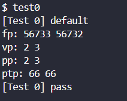
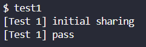
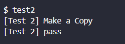
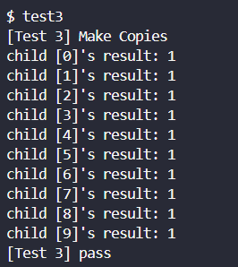

# Project 4

# Design

## Initial Sharing

### 페이지 참조 횟수

- xv6에 있는 모든 페이지를 표현하기 위해 전체 페이지의 수(`PHYSTOP/PGSIZE`)를 구한 다음 그 크기를 가진 배열(`kmem.pgrefcnt`)을 선언해 페이지 참조 횟수를 저장한다.
- 모든 배열 원소의 초기값은 0이다.
- 페이지를 참조하는 프로세스의 수가 배열 원소에 반영되어야 한다. (`copyuvm`, `kalloc` → `incr_refc` / `CoW_handler` , `kfree` →`decr_refc`)

### Locking

- 구현된`kmem.lock`을 이용해 `kmem`의 내부 변수에 접근할 때마다 locking을 한다.

### Fork

- 자식 프로세스 생성 시(`copyuvm`), 모두 같은 페이지를 가리키도록 한다. 그리고 읽기 전용(`~PTW`)으로 설정해 다른 프로세스가 쓰기 작업을 할 때 page fault를 발생시키도록 한다.
- 페이지 참조 수를 증가시킨다(`incr_refc`).

## Make a copy

- 읽기 전용 페이지에 쓰기를 시도할 때 page fault가 발생하고 trap handler(`CoW_handler`)가 호출된다.
- 쓰려고 하는 페이지(`walkpgdir`)를 복사(`kalloc`, `decr_refc`)하고 페이지 테이블을 업데이트한다.

## System Call

### `int countfp(void)`

- 현재 free page의 개수를 저장하는 변수(`kmem.fpcnt`)를 반환한다.

### `int countvp(void)`

- 현재 실행 중인 프로세스의 가상 메모리를 페이지 크기로 순회하면서 user에게 할당된 페이지의 수를 반환한다.

### `int countpp(void)`

- 현재 실행중인 프로세스의 페이지 디렉토리와 페이지 테이블을 순회하면서 user에게 할당된 페이지 수를 반환한다.

### `int countptp(void)`

- 현재 실행중인 프로세스의 페이지 디렉토리에 페이지 테이블에 할당된 페이지 수를 반환한다.

# Implement

## `kalloc.c`

```c
#include "proc.h"
extern int countfp(void);
extern int countvp(void);
extern int countpp(void);
extern int countptp(void);
extern pte_t *walkpgdir(pde_t *pgdir, const void *va, int alloc);
```

- 시스템 콜 구현을 위해 필요한 헤더 파일을 불러온다.
- 시스템 콜 내에서 호출할 함수를 `extern` 선언해준다.

### `struct kmem`

```c
// EDITED
struct {
  struct spinlock lock;
  int use_lock;
  struct run *freelist;
  int fpcnt;
  int pgrefcnt[PHYSTOP/PGSIZE];
} kmem;
```

- `int fpcnt` : 현재 free page 개수를 저장한 변수
- `int pgrefcnt[PHYSTOP/PGSIZE]` : 페이지를 참조하는 프로세스의 수를 저장하는 배열

### `void freerange(void *vstart, void *vend)`

```c
void
freerange(void *vstart, void *vend)
{
  char *p;
  
  p = (char*)PGROUNDUP((uint)vstart);
  for(; p + PGSIZE <= (char*)vend; p += PGSIZE){
    // EDITED : initialize the reference count of each page to 0
    kmem.pgrefcnt[V2P(p)/PGSIZE] = 0;
    kfree(p);
  }
}
```

- `kmem.pgrefcnt`를 초기화한다.

### `void kfree(char *v)`

```c
void
kfree(char *v)
{
  struct run *r;

  if((uint)v % PGSIZE || v < end || V2P(v) >= PHYSTOP)
    panic("kfree");

  if (kmem.use_lock)
    acquire(&kmem.lock);

  // EDITED : Decrease reference count of the page
  if (kmem.pgrefcnt[V2P(v) / PGSIZE] > 0)
  {
    kmem.pgrefcnt[V2P(v) / PGSIZE]--;
  }

  // EDITED : If reference count is 0, free the page
  if (kmem.pgrefcnt[V2P(v) / PGSIZE] == 0)
  {
    // Fill with junk to catch dangling refs.
    memset(v, 1, PGSIZE);
    kmem.fpcnt++;
    
    r = (struct run*)v;
    r->next = kmem.freelist;
    kmem.freelist = r;
  }

  if (kmem.use_lock)
    release(&kmem.lock);
}
```

- 프로세스 참조 수를 감소하고, 0이 되면 초기화한다.
- 0이면`fpcnt`를 증가시키고 free page list에 추가한다.

### `char* kalloc(void)`

```c
char*
kalloc(void)
{
  struct run *r;

  if(kmem.use_lock)
    acquire(&kmem.lock);
  
  // EDITED : Decrease free page count
  kmem.fpcnt--;
  
  r = kmem.freelist;
  if(r){
    kmem.freelist = r->next;

    // EDITED : Set reference count of the page to 1
    kmem.pgrefcnt[V2P((char*)r)/PGSIZE] = 1;
  }

  if(kmem.use_lock)
    release(&kmem.lock);
  return (char*)r;
}
```

- `fpcnt`를 감소시키고, 페이지 참조 수를 1로 초기화한다.

### `int get_refc(uint pa)`

```c
int 
get_refc(uint pa)
{
  if(kmem.use_lock)
    acquire(&kmem.lock);

  int temp = kmem.pgrefcnt[pa / PGSIZE];

  if(kmem.use_lock)
    release(&kmem.lock);
  return temp;
}
```

- (locking을 사용할 경우 lock 후,) 페이지 참조 횟수를 반환한다.

### `void incr_refc(uint pa)`

```c
void 
incr_refc(uint pa){
  if(kmem.use_lock)
    acquire(&kmem.lock);

  kmem.pgrefcnt[pa / PGSIZE]++;

  if(kmem.use_lock)
    release(&kmem.lock);
}
```

- (locking을 사용할 경우 lock 후,) 페이지 참조 횟수를 증가시킨다.

### `void decr_refc(uint pa)`

```c
void 
decr_refc(uint pa)
{
  if(kmem.use_lock)
    acquire(&kmem.lock);

  kmem.pgrefcnt[pa / PGSIZE]--;

  if(kmem.use_lock)
    release(&kmem.lock);
}
```

- (locking을 사용할 경우 lock 후,) 페이지 참조 횟수를 감소시킨다.

### `int countfp(void)`

```c
int countfp(void) {
  if (kmem.use_lock)
    acquire(&kmem.lock);
  int temp = kmem.fpcnt;
  if (kmem.use_lock)
    release(&kmem.lock);
  return temp;
}
```

- 시스템에 있는 free page의 총 개수(`kmem.fpcnt`)를 반환한다.
- `kmem` 내부의 변수에 접근하기 때문에 앞뒤로 lock을 설정했다.

### `int countvp(void)`

```c
int countvp(void)
{
  struct proc* p = myproc();
  int sz = p->sz;

  int count = 0;
  
  for(int i = 0; i < sz; i += PGSIZE)
  {
    pte_t* pte = walkpgdir(p->pgdir, (void*)i, 0);
    if(pte && (*pte & PTE_U))
    {
      count++;
    }
  }

  return count;
}
```

- `i`는 page의 base를 가리키고, `pte`를 구해 유효한 페이지인지 확인한다.

### `int countpp(void)`

```c
int countpp(void)
{
  struct proc* p = myproc();
  pde_t* pgdir = p->pgdir;

  int count = 0;
  pde_t* pde;

  for (int i = 0; i < NPDENTRIES; i++)
  {
    pde = &pgdir[i];
    if (*pde & PTE_U)
    {
      pte_t* pte = (pte_t*)P2V(PTE_ADDR(*pde));
      for (int j = 0; j < NPTENTRIES; j++)
      {
        if (pte[j] & PTE_U)
        {
          count++;
        }
      }
    }
  }
  return count;
}
```

- `pgdir`안에 `pde`를 순회하고, `pde` 안에 `pte`를 순회하면서 페이지가 유효한지 확인한다.

### `int countptp(void)`

```c
int countptp(void) {
  struct proc *curproc = myproc();
  pde_t* pgdir = curproc->pgdir;

  int count = 1;
  pde_t* pde;

  for (int i = 0; i < NPDENTRIES; i++)
  {
    pde = &pgdir[i];
    if (*pde & PTE_P)
    {
      count++;
    }
  }
  return count;
}
```

- `countpp`랑 비슷하게 `pde`를 순회하면서 유효한 페이지인지 확인한다.
- 페이지 디렉토리가 할당된 커널 메모리 페이지의 수도 더해준다.

## `vm.c`

```c
extern pte_t* walkpgdir(pde_t *pgdir, const void *va, int alloc);
```

- 다른 파일에서도 호출할 수 있도록 `extern` 선언해준다.

### `pde_t* copyuvm(pde *pgdir, uint sz)`

```c
pde_t*
copyuvm(pde_t *pgdir, uint sz)
{
  pde_t *d;
  pte_t *pte;
  uint pa, i, flags;
  // char *mem;

  if((d = setupkvm()) == 0)
    return 0;
  for(i = 0; i < sz; i += PGSIZE){
    if((pte = walkpgdir(pgdir, (void *) i, 0)) == 0)
      panic("copyuvm: pte should exist");
    if(!(*pte & PTE_P))
      panic("copyuvm: page not present");
    
    // EDITED : Set pte to read-only
    *pte &= ~PTE_W;
    pa = PTE_ADDR(*pte);
    flags = PTE_FLAGS(*pte);

    // if((mem = kalloc()) == 0)
    //   goto bad;
    // memmove(mem, (char*)P2V(pa), PGSIZE);

    // EDITED
    if(mappages(d, (void*)i, PGSIZE, pa, flags) < 0) {
      // kfree(mem);
      goto bad;
    }
    incr_refc(pa);
  }
  
  // EDITED : Flush TLB
  lcr3(V2P(pgdir));  
  return d;

bad:
  freevm(d);
  return 0;
}
```

- 페이지가 복사될 때, 실제로 복사되는 것이 아니라, 페이지 테이블이 같은 페이지를 가리키게 설정한다.
- 페이지를 읽기 전용으로 설정한 후, 참조 횟수를 증가시키고, 페이지 테이블을 flush한다.

### `void CoW_handler(void)`

```c
void CoW_handler(void)
{
  uint va = rcr2();
  if(va < 0){
    cprintf("CoW_handler: cannot find virtual address %x\n", va);
    myproc()->killed = 1;
    return;
  }

  pte_t *pte = walkpgdir(myproc()->pgdir, (void *) va, 1);
  if(pte == 0){
    cprintf("CoW_handler: cannot find page table entry %x\n", va);
    myproc()->killed = 1;
    return;
  }

  if(*pte & PTE_W){
    cprintf("CoW_handler: page is already writable %x\n", va);
    myproc()->killed = 1;
    return;
  }

  uint pa = PTE_ADDR(*pte);
  int refc = get_refc(pa);
  if(refc > 1){
    char *mem = kalloc();
    if(mem == 0){
      panic("CoW_handler: kalloc failed");
      return;
    }

    memmove(mem, (char*)P2V(pa), PGSIZE);
    *pte = V2P(mem) | PTE_P | PTE_U | PTE_W;
    decr_refc(pa);
  }
  else if(refc == 1){
    *pte |= PTE_W;
  }
  lcr3(V2P(myproc()->pgdir));

}
```

- 가상 주소(`va`)를 `rcr2()` 함수를 사용하여 가져온다. 만약 가상 주소가 0보다 작으면, 주소를 찾을 수 없다는 것을 의미하므로, 에러 메시지를 출력하고 현재 프로세스의 `killed` 플래그를 1로 설정한 후 함수를 종료한다.
- 다음으로, 가상 주소에 해당하는 페이지 테이블 엔트리(`pte`)를 찾는다. 이를 위해 `walkpgdir()` 함수를 호출하며, 이 함수에는 현재 프로세스의 페이지 디렉토리(`pgdir`)와 가상 주소가 전달된다. 만약 페이지 테이블 엔트리를 찾을 수 없으면(`pte == 0`), 에러 메시지를 출력하고 `killed` 플래그를 설정한 후 함수를 종료한다.
- 그 후, 코드는 페이지 테이블 엔트리의 `PTE_W` 플래그를 확인하여 페이지가 이미 쓰기 가능한지 확인한다. 만약 페이지가 이미 쓰기 가능하면(`*pte & PTE_W`가 참이면), 에러 메시지를 출력하고 `killed` 플래그를 설정한 후 함수를 종료한다.
- 페이지가 쓰기 불가능한 경우, 코드는 페이지 테이블 엔트리에 해당하는 물리 페이지의 참조 카운트(`refc`)를 확인한다. `get_refc()` 함수를 사용하여 참조 카운트를 가져온다. 참조 카운트가 1보다 크면, 페이지가 여러 프로세스에 의해 공유되고 있으므로 쓰기 가능하게 만들기 전에 복사해야 한다.
- 이 경우, `kalloc()`을 사용하여 새 페이지를 할당한다. 만약 할당이 실패하면(`mem == 0`), 함수는 패닉 상태로 전환하고 종료한다. 그렇지 않으면, `memmove()`를 사용하여 원래 페이지의 내용을 새로 할당된 페이지로 복사한다. 페이지 테이블 엔트리는 새 물리 페이지를 가리키도록 업데이트되며, `PTE_P`, `PTE_U`, `PTE_W` 플래그가 설정된다. 마지막으로, 원래 물리 페이지의 참조 카운트가 `decr_refc()`를 사용하여 감소된다.
- 참조 카운트가 정확히 1인 경우, 페이지는 현재 프로세스만이 사용하고 있음을 의미한다. 이 경우, 코드는 페이지 테이블 엔트리의 `PTE_W` 플래그를 설정하여 페이지를 쓰기 가능하게 만든다.
- 마지막으로, 함수는 `lcr3()`를 호출하여 페이지 디렉토리 레지스터(`CR3`)를 현재 프로세스의 페이지 디렉토리의 물리 주소로 업데이트한다.

## `trap.c`

### `void trap(struct trapframe *tf)`

- `switch` 안에 page fault를 처리하는 분기를 만든 후, `CoW_handler` 함수를 호출한다.

## `sysproc.c`

```c
extern int countfp(void);
extern int countvp(void);
extern int countpp(void);
extern int countptp(void);

int
sys_countfp(void){
  return countfp();
}

int
sys_countvp(void){
  return countvp();
}

int 
sys_countpp(void){
  return countpp();
}

int
sys_countptp(void){
  return countptp();
}
```

- 시스템 콜을 구현한다. (`syscall.h`, `syscall.c`, `Usys.s`, `user.h` 에도 추가한다.)

# Result

## `bootxv6.sh`

```bash
make clean
make && make fs.img
qemu-system-i386 -nographic -serial mon:stdio -hdb fs.img xv6.img -smp 1 -m 512
```

## test0



- fp, vp, pp를 모두 출력하게 테스트를 수정했다. `sbrk` 함수 호출 이후 페이지가 하나 더 할당된 것을 확인할 수 있다.

## test1



## test2



## test3

